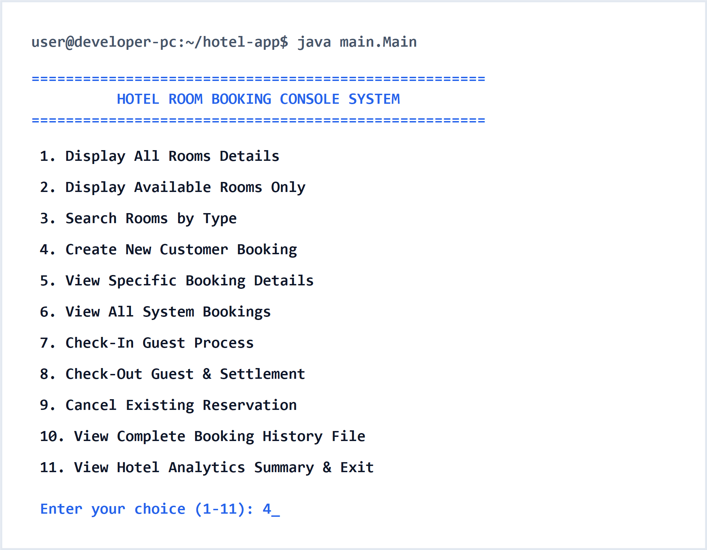
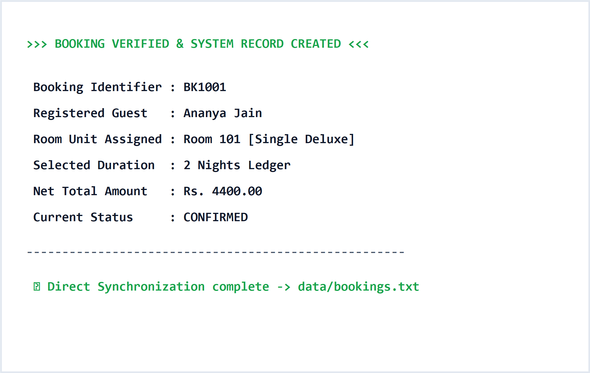
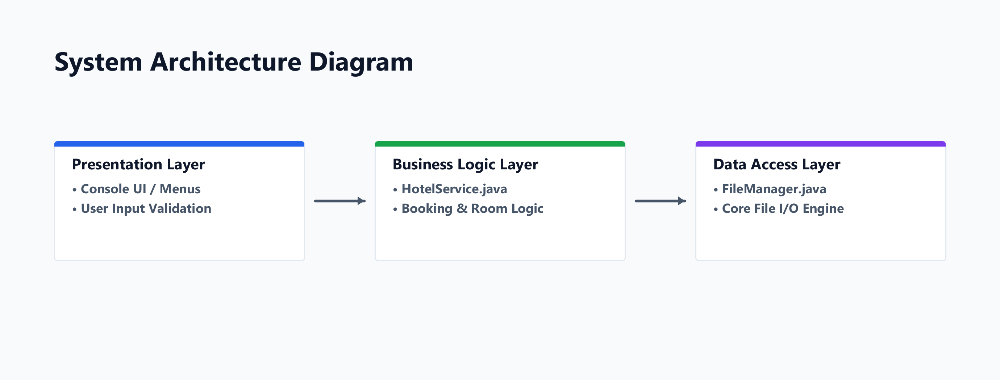
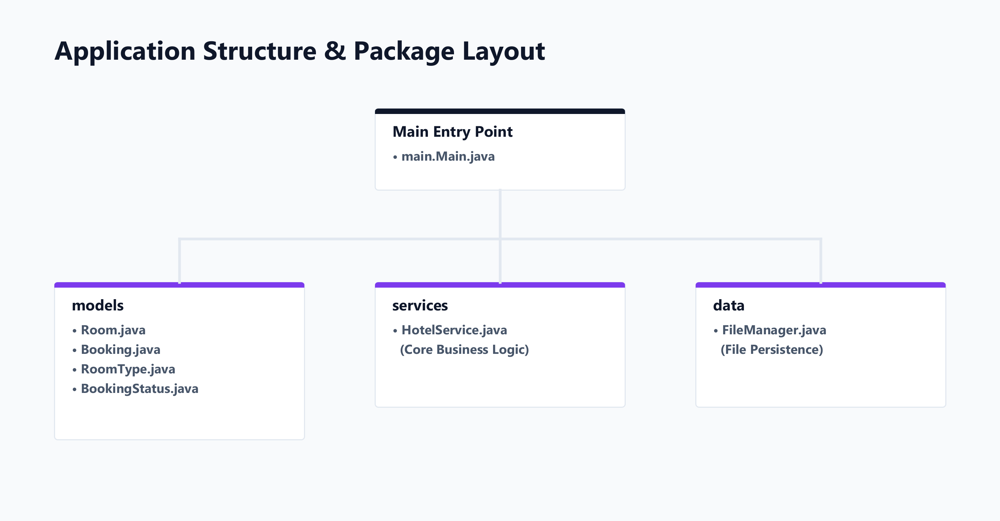
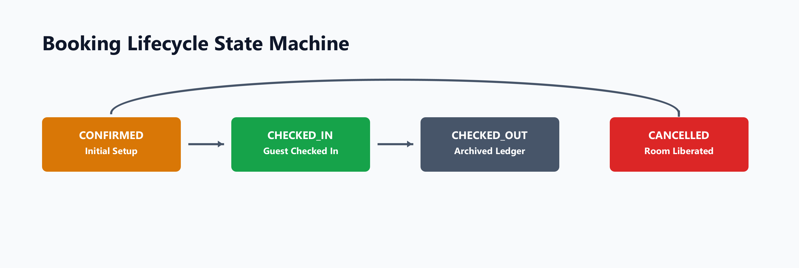

# 🏨 Hotel Room Booking Console App

A Java-based console application that simulates a real-world hotel room booking management system.  
The project implements room availability management, customer booking, billing calculation, cancellation, check-in/check-out workflow, and file-based booking history using Object-Oriented Programming principles.

This project is designed as a practical Java application demonstrating backend business logic, clean architecture, and real-world software development practices.

---

# 📌 Project Overview

The **Hotel Room Booking Console App** helps manage hotel operations through a menu-driven command-line interface.

The system allows users to:

- View available rooms
- Search rooms by type
- Create customer bookings
- Generate booking IDs
- Calculate bills automatically
- Check-in guests
- Check-out guests
- Cancel reservations
- Maintain booking history

The application follows a layered architecture where models, business logic, utilities, and user interaction are separated for better maintainability.

---

# 🎯 Problem Statement

Hotels need efficient systems to manage:

- Room inventory
- Customer information
- Booking schedules
- Availability checking
- Billing
- Reservation cancellation

Manual management can lead to:

- Double booking
- Calculation errors
- Data inconsistency
- Slow customer service

This project provides a simplified digital solution for managing hotel booking workflows.

---

# 🌍 Industry Relevance

Hotel management systems are widely used in:

- Hotels
- Resorts
- Hostels
- Guest houses
- Travel companies
- Property management platforms

Modern Property Management Systems (PMS) use similar concepts:

- Room inventory management
- Reservation handling
- Customer records
- Billing systems
- Reports and analytics

This project demonstrates the core backend logic behind such systems.

---

# ✨ Features

## 🏨 Room Management

✔ Display all hotel rooms  
✔ View room availability  
✔ Search rooms by type  
✔ Track room status  

Supported room types:

- Single
- Double
- Suite


---

## 👤 Customer Management

✔ Store guest details

Information handled:

- Guest name
- Phone number
- Email
- ID proof details


---

## 📅 Booking Management

✔ Create new bookings  
✔ Generate unique booking IDs  
✔ Store booking details  
✔ View booking information  
✔ Maintain booking history  


---

## 💰 Billing System

Automatic bill generation includes:

- Number of nights
- Room charges
- Tax calculation
- Final payable amount


Example:

```
Room Charge : ₹4000
GST (10%)    : ₹400

Total        : ₹4400
```

---

## 🔄 Reservation Workflow

```
Customer
   |
   ↓
Search Available Room
   |
   ↓
Select Room
   |
   ↓
Enter Guest Details
   |
   ↓
Create Booking
   |
   ↓
Generate Bill
   |
   ↓
Check-In
   |
   ↓
Check-Out
   |
   ↓
Booking History Saved
```

---

# 🏗️ System Architecture


```
                 USER
                  |
                  |
             Main.java
                  |
                  |
          HotelService.java
                  |
        --------------------
        |                  |
        ↓                  ↓
  Model Classes       Utility Classes

 Room.java            FileManager.java
 Guest.java           BillCalculator.java
 Booking.java         BookingIdGenerator.java

                  |
                  ↓

             bookings.txt
```

---

# 🧩 Project Structure

```
Hotel-Room-Booking-Console-App/

│
├── src/
│
│── model/
│   ├── Room.java
│   ├── Guest.java
│   ├── Booking.java
│   ├── RoomType.java
│   ├── RoomStatus.java
│   └── BookingStatus.java
│
│── service/
│   └── HotelService.java
│
│── util/
│   ├── FileManager.java
│   ├── BookingIdGenerator.java
│   └── BillCalculator.java
│
│── main/
│   └── Main.java
│
├── data/
│   └── bookings.txt
│
├── images/
│   ├── system_architecture.png
│   ├── class_diagram.png
│   ├── booking_flow.png
│   ├── main_menu.png
│   └── booking_confirmation.png
│
├── README.md
├── LICENSE
└── .gitignore

```

---

# 🛠️ Technology Stack

## Programming Language

- Java 17

## Concepts Used

- Object-Oriented Programming
- Classes and Objects
- Encapsulation
- Constructors
- Enums
- Collections Framework
- Exception Handling
- File Handling
- Date and Time API


---

# 🧠 Java Concepts Demonstrated


## Classes and Objects

Used to represent real-world entities:

Example:

```
Room
Guest
Booking
```

---

## Encapsulation

Data is protected using:

- private variables
- getters
- setters


---

## Collections

Used for storing:

- rooms
- bookings
- customer records


Examples:

```
ArrayList
HashMap
```

---

## File Handling

Booking records are stored permanently using:

```
data/bookings.txt
```

---

## Date Handling

Java LocalDate API is used for:

- check-in dates
- check-out dates
- stay duration calculation


---

# 📸 Application Screenshots


## Main Menu




## Booking Confirmation




## System Architecture




## Class Diagram




## Booking Flow




---

# ▶️ How To Run The Project


## Requirements

Install:

- Java Development Kit (JDK 17+)
- IntelliJ IDEA / Eclipse / VS Code


Check Java installation:

```
java -version
```

---

# Run Using Command Line


Compile:

```
javac src/main/Main.java
```

Run:

```
java src.main.Main
```

---

# Run Using IntelliJ IDEA


1. Open project folder

2. Mark `src` as source folder

3. Navigate to:

```
src/main/Main.java
```

4. Run Main.java


---

# 💻 Sample Output


```
================================
Hotel Room Booking System
================================

1. Display All Rooms
2. Search Available Rooms
3. Create Booking
4. View Booking
5. Cancel Booking
6. Check-In
7. Check-Out
8. Exit


Enter choice: 3


Enter Guest Name:
Ananya Jain


Booking Created Successfully


Booking ID:
BK1001


Room:
101


Total Amount:
₹4400


Status:
CONFIRMED

```

---

# 🧪 Testing Performed


| Test Case | Expected Result |
|---|---|
| Valid booking | Booking created successfully |
| Invalid date | Error message displayed |
| Checkout before check-in | Booking rejected |
| Unavailable room | Room not shown |
| Cancel booking | Status changed to cancelled |
| Invalid booking ID | Error displayed |
| Empty guest name | Input rejected |

---

# 🚀 Future Enhancements


## Database Integration

Replace file storage with:

- MySQL
- JDBC


## Backend Development

Convert into:

- Spring Boot REST API
- Microservice architecture


## Frontend

Add:

- React.js
- JavaFX GUI


## Advanced Features

- User authentication
- Admin dashboard
- Online payment simulation
- Email booking confirmation
- Dynamic pricing
- Cloud deployment


---

# 🎓 Learning Outcomes


Through this project, I learned:

✔ Designing Java applications using OOP principles  
✔ Implementing real-world business logic  
✔ Managing data using collections  
✔ Handling files for persistence  
✔ Creating modular software architecture  
✔ Building GitHub-ready documentation  


---

# 👨‍💻 Author

**Ananya Jain**

---

# 📄 License

This project is licensed under the MIT License.

---

⭐ If you find this project useful, consider giving it a star!
